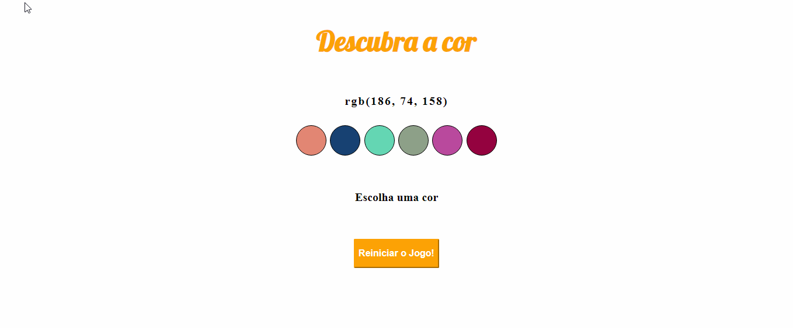

## 🛠 Tecnologias

<br>

- **Web**
  - [HTML](https://html.spec.whatwg.org/multipage/)
  - [CSS](https://www.w3.org/TR/css3-roadmap/)
  - [JavaScript](https://developer.mozilla.org/en-US/docs/Web/JavaScript)
  - [Live Server](https://marketplace.visualstudio.com/items?itemName=ritwickdey.LiveServer)


Clone o repositório com:

```bash
> git clone https://github.com/eloilsondosanjos/try-color.git
```

<div>
  <p>Para executar o projeto, instale no seu VSCode a extensão Live Server e click no icone na barra inferior direita do VSCode</p>
  <br>
  
</div>

<br>

## 📜 License

O projeto está sobre a licença [MIT](./LICENSE) ❤️ 

Gostou? Deixe uma estrelinha para ajudar o projeto ⭐
